# Manual de usuario · Atenea, centro de mando interno

**Versión del manual:** 1.0 (septiembre de 2026) · **Para:** Mónica y el equipo de Atenea.
No hace falta saber programar para usar la app.

> Las imágenes de este manual usan **datos de ejemplo**. Tus pantallas mostrarán tus propias señales
> y fichas.

---

## Contenido

1. [Qué es Atenea y para qué sirve](#1-qué-es-atenea-y-para-qué-sirve)
2. [Abrir y cerrar la app](#2-abrir-y-cerrar-la-app)
3. [La pantalla principal](#3-la-pantalla-principal)
4. [Tablero](#4-tablero)
5. [Radar: señales, matriz, taxonomía y fuentes](#5-radar)
6. [Cerebro: normativa y skills](#6-cerebro)
7. [Fábrica: fichas de producto y compuertas](#7-fábrica)
8. [Canal: ventas](#8-canal-ventas)
9. [Ajustes y respaldo](#9-ajustes-y-respaldo)
10. [Rutinas recomendadas](#10-rutinas-recomendadas)
11. [Actualizar la app](#11-actualizar-la-app)
12. [Problemas frecuentes](#12-problemas-frecuentes)
13. [Glosario](#13-glosario)

---

## 1. Qué es Atenea y para qué sirve

Atenea es una aplicación **de uso interno** que corre **en tu computador**. Responde tres
preguntas:

1. **¿Qué les duele hoy a los docentes de educación superior?** Busca sola en noticias y foros de
   19 países: 17 de Latinoamérica y el Caribe, más México y España.
2. **¿Dónde duele más?** Ordena los dolores por país según cuánto, qué tan fuerte y qué tan reciente
   se habla de ellos.
3. **¿Qué conviene producir y vender?** Convierte el dolor más fuerte en una ficha de producto, con
   evidencia y con tus compuertas de calidad.

El recorrido completo tiene cuatro etapas, que corresponden a los cuatro módulos del ecosistema:

| Etapa | Módulo | Qué pasa |
|---|---|---|
| 1 | **Radar** | Recoge publicaciones (señales), la IA las clasifica y tú confirmas. |
| 2 | **Cerebro** | Guarda la normativa por país y las skills de producción. |
| 3 | **Fábrica** | Convierte un dolor en una ficha de producto con 3 compuertas. |
| 4 | **Canal** | Registra lo vendido, y las ventas vuelven a alimentar el Radar. |

**Regla de oro: la IA propone y tú decides.** Ninguna ficha avanza sin tu veredicto escrito.

---

## 2. Abrir y cerrar la app

### Abrir

- Haz doble clic en el ícono **Atenea** de tu escritorio. El navegador se abre solo en
  `http://localhost:5180`.
- **Si la app ya estaba abierta,** el doble clic solo abre la pestaña.
- **Después de una actualización,** la primera apertura tarda unos minutos porque instala lo que
  cambió.

Si no tienes el ícono, entra a la carpeta de la app y abre `atenea-app\Iniciar Atenea.bat`. La
primera vez que lo haces, crea el ícono.

### Mientras la usas

- **Al abrir la app** aparece una ventana negra llamada **«Atenea - Centro de mando»**,
  **minimizada** en la barra de tareas. Esa ventana es la app funcionando.
- **Puedes cerrar la pestaña del navegador** sin problema: la app sigue corriendo. Para volver,
  haz doble clic otra vez en el ícono.

### Cerrar

- Abre la ventana **«Atenea - Centro de mando»** desde la barra de tareas y ciérrala con la **X**.

### Importante

- **La búsqueda automática de señales solo corre mientras la app está abierta.** Ábrela al menos
  una vez al día y déjala abierta unos 15 minutos.
- **Todo queda en tu computador.** La app no se ve desde internet ni desde otros equipos.

---

## 3. La pantalla principal

A la izquierda está el **menú**, agrupado por módulo:

| Grupo | Páginas |
|---|---|
| **Inicio** | Tablero |
| **Radar** | Señales · Matriz de saliencia · Taxonomía de dolores · Fuentes y recolección |
| **Cerebro** | Normativa por país · Skills de producción |
| **Fábrica** | Fichas de producto |
| **Canal** | Ventas |
| **Sistema** | Ajustes y respaldo |

Abajo, en el menú, siempre ves tres datos:
- qué IA está activa y si tiene clave;
- cuándo fue la última recolección;
- si la copia en Firestore está configurada.

**Los avisos** aparecen abajo a la derecha: **azules** si algo salió bien, **rojos** si hubo un
error. Los avisos rojos explican qué pasó; si no lo entiendes, copia el mensaje y compártelo.

---

## 4. Tablero

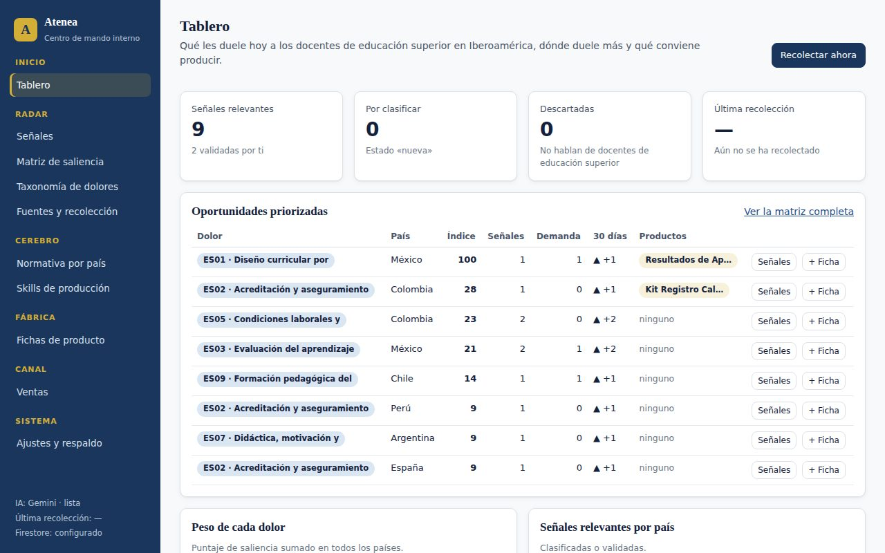

Es la vista de resumen. Tiene cuatro partes.

**Cifras de arriba**
- **Señales relevantes:** publicaciones que sí hablan de un dolor docente de educación superior.
- **Por clasificar:** señales recién llegadas que la IA aún no ha revisado.
- **Descartadas:** señales que no tratan de docentes de educación superior.
- **Última recolección:** cuándo fue, cuántas señales llegaron y cuándo será la próxima.

**Oportunidades priorizadas**

Son las combinaciones **dolor + país** con más peso, ordenadas de mayor a menor.

| Columna | Qué significa |
|---|---|
| **Índice** | Puntaje de 0 a 100, relativo a la combinación más fuerte (esa tiene 100). |
| **Señales** | Cuántas publicaciones hablan de ese dolor en ese país. |
| **Demanda** | Cuántas de esas publicaciones piden una solución (una guía, un curso, una plantilla). |
| **30 días** | Cuántas señales más (▲) o menos (▼) llegaron en los últimos 30 días que en los 30 anteriores. |
| **Productos** | Fichas que ya existen para ese dolor y país. «ninguno» indica una oportunidad libre. |

Cada fila tiene dos botones:
- **Señales** muestra la evidencia de esa combinación.
- **+ Ficha** empieza una ficha de producto con ese dolor y país.

**Gráficos**
- **Peso de cada dolor:** qué dolores pesan más, sumando todos los países.
- **Señales relevantes por país:** dónde se está hablando más.
- **Señales por día:** cómo llegan las señales en los últimos 60 días.

Al pasar el mouse sobre una barra ves el detalle. Al hacer clic, vas a sus señales.

**Botón «Recolectar ahora»:** lanza una búsqueda en ese momento, sin esperar la automática. Tarda
unos minutos.

---

## 5. Radar

### 5.1 Señales

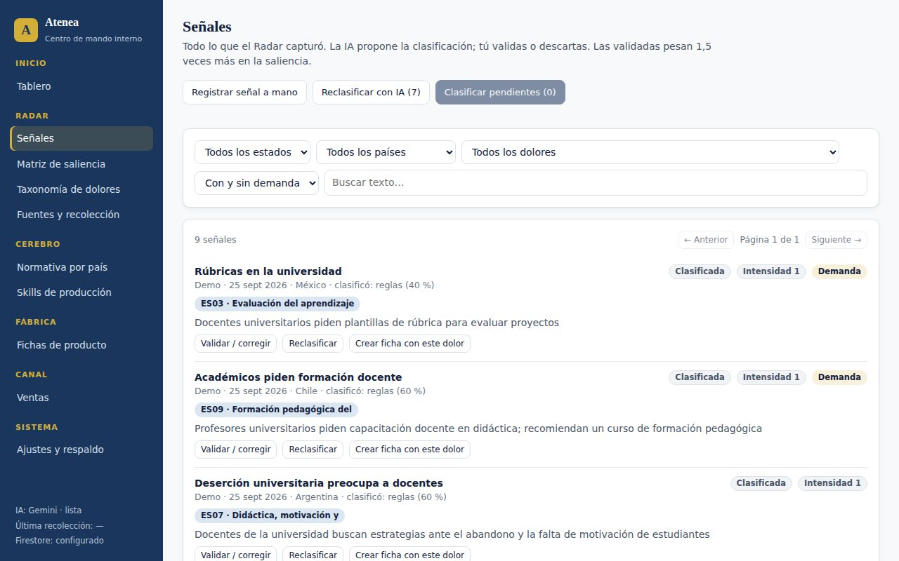

Aquí está todo lo que el Radar capturó.

**Qué muestra cada señal:**
- el título, con un enlace a la fuente original;
- el medio, la fecha, el país y quién la clasificó (`ia:gemini`, `ia:claude`, `reglas` o `manual`);
- el **estado**:

| Estado | Significa |
|---|---|
| **Nueva** | Llegó y aún no se clasifica. |
| **Clasificada** | La IA la consideró relevante. |
| **Validada** | Tú la confirmaste. Pesa **1,5 veces más** en la saliencia. |
| **Descartada** | No trata de docentes de educación superior (la IA o tú lo decidieron). |

- la **intensidad**:
  - 1 = solo se menciona el problema;
  - 2 = hay una queja explícita;
  - 3 = hay una crisis o urgencia.
- la etiqueta **Demanda**, si alguien pide una solución;
- los **dolores** (ES01…ES09), la **frase-dolor** (una cita textual) y un resumen.

**Filtros:** por estado, país, dolor, con o sin demanda, y un buscador de texto. Para buscar,
escribe y pulsa **Enter**.

**Botones de cada señal:**
- **Validar / corregir:** abre la ventana para confirmar o ajustar la clasificación. Se explica
  abajo.
- **Reclasificar:** la vuelve a pasar por la IA.
- **Rescatar:** solo aparece en las descartadas. Sirve para corregir un descarte equivocado.
- **Crear ficha con este dolor:** empieza una ficha en la Fábrica.

**Botones de arriba:**
- **Registrar señal a mano:** para evidencia que la app no encuentra sola. Se explica abajo.
- **Clasificar pendientes (N):** manda a la IA las señales en estado «nueva».
- **Reclasificar con IA (N):** aparece si hay señales que se clasificaron con palabras clave, por
  ejemplo antes de tener clave de IA. Las vuelve a clasificar con IA. Las que validaste no se tocan.

#### Validar o corregir una señal

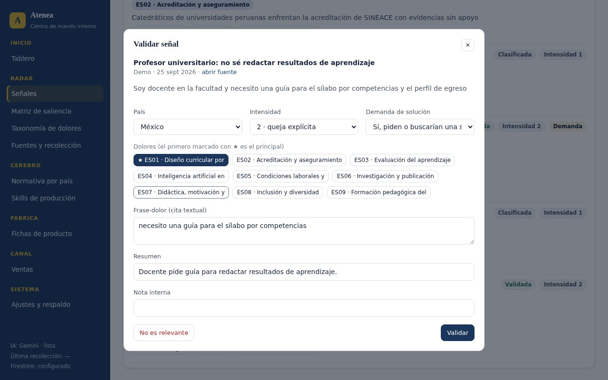

1. **Lee el texto.** Si hace falta, abre la fuente con **abrir fuente**.
2. **Ajusta los datos:** **País**, **Intensidad** y **Demanda de solución**.
3. **Marca los dolores que aplican.** El marcado con **★** es el principal. Si marcas varios,
   elige el principal en la lista que aparece.
4. **Completa los textos** si quieres:
   - **Frase-dolor:** una cita textual del texto, entre comillas si es posible.
   - **Resumen:** una oración con el dolor.
   - **Nota interna:** solo para ti.
5. **Decide:**
   - Pulsa **Validar** si la señal es relevante.
   - Pulsa **No es relevante** si no habla de docentes de educación superior.

> **Consejo:** para el piloto, cuenta cuántas señales acertó la IA **sin** que tuvieras que cambiar
> nada. Es la medida de su precisión.

#### Registrar una señal a mano

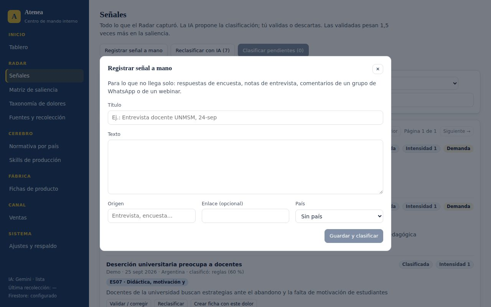

Úsalo para lo que solo tú tienes:
- respuestas de la encuesta al panel;
- notas de entrevistas;
- comentarios de grupos de WhatsApp;
- preguntas de docentes en tus cursos o webinars.

Escribe un título, pega el texto, indica el origen y el país, y pulsa **Guardar y clasificar**. La IA
lo clasifica al instante; después puedes validarlo.

### 5.2 Matriz de saliencia

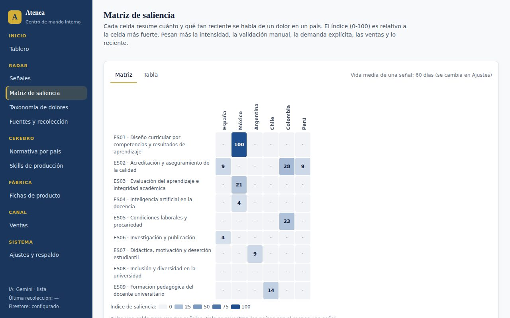

La matriz cruza **dolores** (filas) con **países** (columnas). Cada celda muestra el **índice de
0 a 100**:

- **Cuanto más oscura la celda, más peso tiene ese dolor en ese país.**
- **Un punto (·)** significa que todavía no hay señales en esa celda.
- **Solo aparecen los países** que tienen al menos una señal.
- **Al pasar el mouse** ves el detalle: señales, demanda, ventas y tendencia.
- **Al hacer clic** vas a las señales de esa celda.
- **La pestaña «Tabla»** muestra los mismos datos en lista, ordenados de mayor a menor.

**Qué hace que una celda pese más:**
1. Muchas señales.
2. Intensidad alta (quejas y crisis, no solo menciones).
3. Señales validadas por ti.
4. Personas pidiendo solución (demanda).
5. Ventas de productos que atacan ese dolor en ese país.
6. Lo reciente: una señal pierde la mitad de su peso cada 60 días. Ese plazo se cambia en Ajustes.

> **Cómo leerla:** la matriz orienta, no decide. Antes de producir, abre las señales de la celda y
> confirma que la evidencia tiene sentido.

### 5.3 Taxonomía de dolores

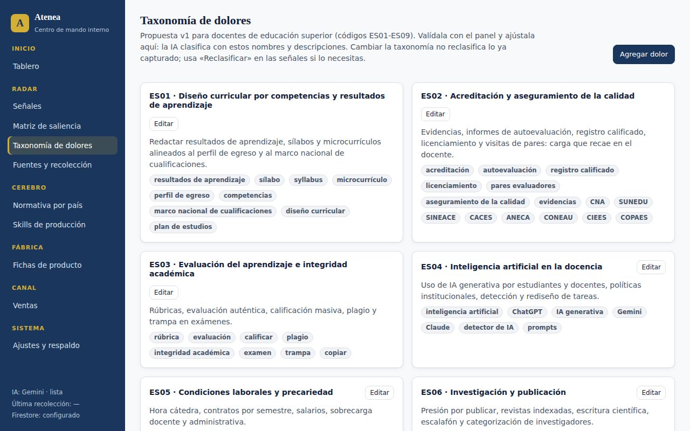

Es la **lista de dolores** con la que la IA clasifica. Hoy son 9 (ES01 a ES09). Es una
**propuesta v1** que conviene validar con el panel de docentes.

- **Cada dolor tiene:**
  - un **código**;
  - un **nombre**;
  - una **descripción**, que la IA lee para decidir;
  - **palabras clave**, que se usan cuando no hay IA disponible.
- **Editar:** cambia el nombre, la descripción, las palabras clave o si está activo.
- **Agregar dolor:** crea uno nuevo, por ejemplo con el código `ES10`.
- **Desactivar un dolor** lo saca de la clasificación y de la matriz sin borrarlo.

> **Cambiar la taxonomía no reclasifica lo que ya se capturó.** Si haces un cambio grande, usa
> **Reclasificar** en las señales que te interesen.

### 5.4 Fuentes y recolección

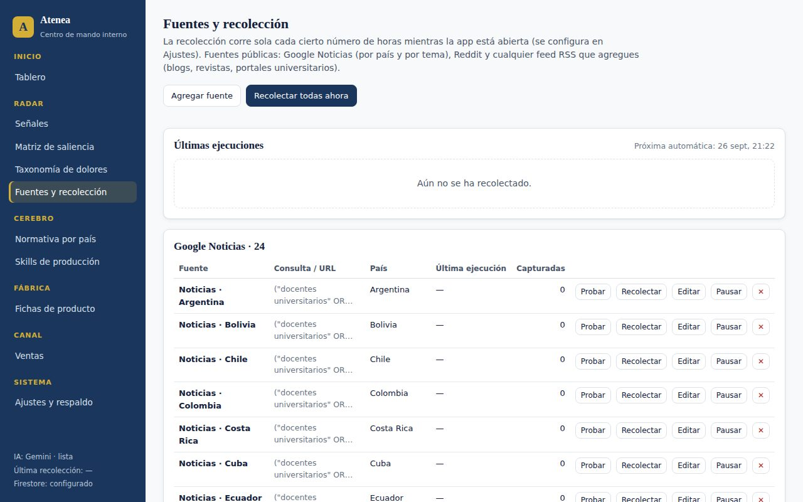

Son los lugares donde el Radar busca:

| Tipo | Qué trae | Nota |
|---|---|---|
| **Google Noticias** | Una búsqueda por país, más cinco por tema. | Trae **titulares**, no el artículo completo. |
| **Reddit** | Publicaciones de foros. | Trae el texto completo. |
| **RSS** | Blogs, revistas o portales universitarios que tú agregues. | Trae el texto que publique cada sitio. |

**Últimas ejecuciones:** registro de cada búsqueda, con las señales nuevas, las clasificadas y las
fuentes que dieron error. Si una fuente falla, el error aparece en rojo en su fila.

**Botones de cada fuente:**
- **Probar:** muestra lo que encontraría ahora, sin guardar nada.
- **Recolectar:** busca solo en esa fuente.
- **Editar:** cambia la consulta, el país o la URL.
- **Pausar / Activar:** la saca de la búsqueda automática sin borrarla.
- **✕:** la elimina. Las señales que ya trajo se conservan.

**Agregar fuente:** eliges el tipo y completas los datos.
- **Google Noticias:**
  - Admite comillas para frases exactas: `"docentes universitarios"`.
  - Admite `OR` para alternativas.
  - Admite `when:30d` para limitar la antigüedad a 30 días.
- **Reddit:** una búsqueda. Deja «subreddit» vacío para buscar en todo Reddit.
- **RSS:** la dirección del feed, que suele terminar en `/feed` o `/rss`.

Para cualquier tipo, puedes fijar un país que se asigna a todo lo capturado. Si lo dejas vacío, la
IA detecta el país.

> **Consejo:** si una fuente solo trae señales irrelevantes durante una semana, **páusala**.

---

## 6. Cerebro

### 6.1 Normativa por país

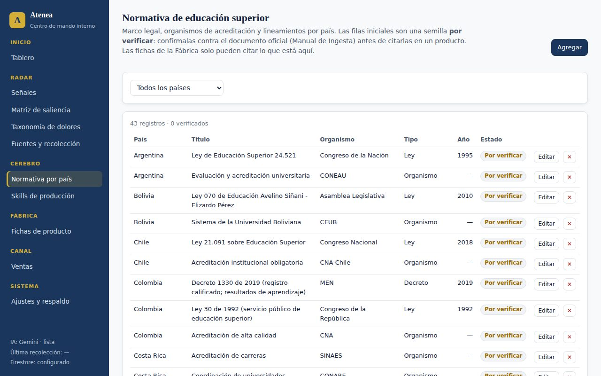

Es el marco legal de educación superior de cada país: leyes, decretos, acuerdos y organismos de
acreditación. **Las fichas de la Fábrica solo pueden citar lo que está aquí.**

- **Todas las filas iniciales están marcadas «Por verificar».** Son una semilla de partida.
- **Antes de citar una fila en un producto:**
  1. Busca el documento oficial.
  2. Pulsa **Editar**.
  3. Pega la **URL oficial**.
  4. Cambia la verificación a **«Verificado contra el documento oficial»**.

  La app no deja marcar una fila como verificada sin URL.
- **Agregar:** registra una norma nueva. Si ya está en el corpus del Cerebro, anota su ID `ATH-…`.
- **Dolores con los que se relaciona:** sirve para ubicar rápido qué norma sustenta cada dolor.

> **Cuidado legal (directriz permanente):** en el material comercial nunca escribas de forma que
> sugiera aval de un ministerio o agencia. Usa «verificado contra el documento oficial».

### 6.2 Skills de producción

Muestra las 15 skills de producción de Antigravity (SKL-GEN, SKL-PRO, SKL-DIS…), leídas
directamente de la carpeta `agents/skills/` del proyecto. Pulsa **Leer** para ver las
instrucciones de cada una. La IA las tiene en cuenta al proponer una ficha.

---

## 7. Fábrica

### 7.1 Lista de fichas

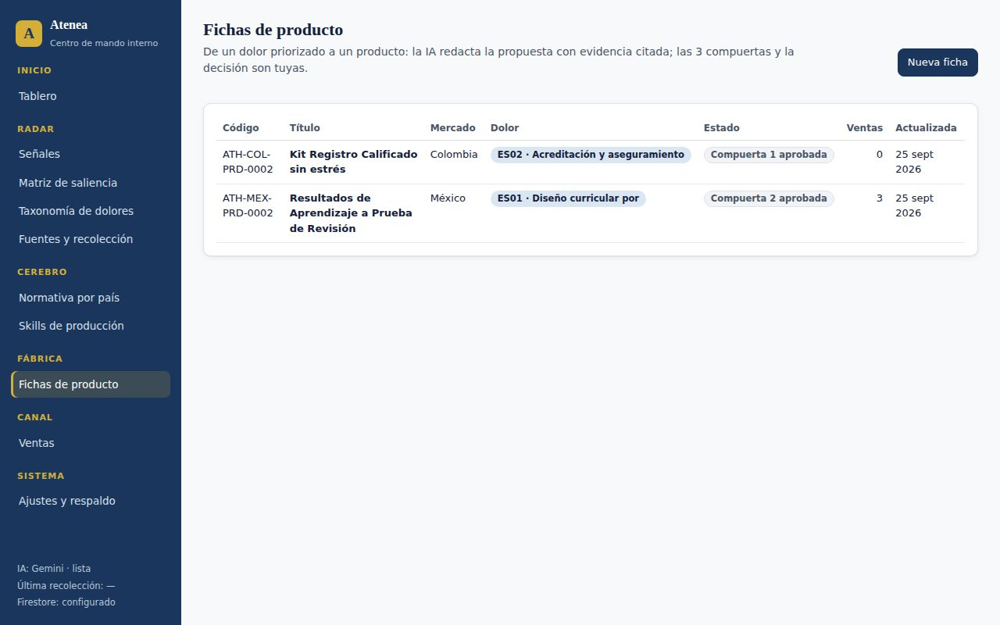

Muestra todas las fichas, con su código, título, mercado, dolor, estado y ventas. Haz clic en una
fila para abrirla.

### 7.2 Crear una ficha

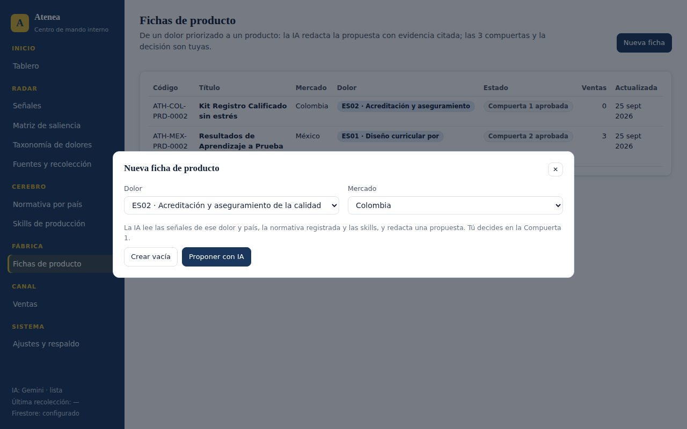

Hay tres caminos para empezar una ficha:
- desde el **Tablero**, con el botón **+ Ficha** de una oportunidad;
- desde **Señales**, con **Crear ficha con este dolor**;
- desde la **Fábrica**, con **Nueva ficha**.

Luego:

1. **Elige el dolor y el mercado:** un país o «Varios países».
2. **Elige cómo empezar:**
   - **Proponer con IA:** la IA lee las señales de ese dolor y país, la normativa registrada y las
     skills, y redacta una propuesta. Tarda hasta uno o dos minutos.
   - **Crear vacía:** una ficha en blanco para llenarla tú.
3. **Revisa la propuesta:**
   - problema;
   - público;
   - formato y piezas;
   - skills que se usarían;
   - diferenciador y competencia;
   - precio (siempre como hipótesis);
   - riesgos;
   - preguntas para validar con el panel;
   - evidencia citada por número de señal y normativa citada.
4. **Guárdala o descártala:** pulsa **Guardar como borrador**, o **Descartar propuesta** si no te
   convence.

**Reglas que la IA respeta al redactar:**
- Solo cita señales y normativa que existen en la app.
- Marca los precios y los supuestos como hipótesis.
- No usa frases que sugieran aval de una autoridad.
- Propone productos que no dependan de que el docente pague una IA.

### 7.3 Trabajar una ficha

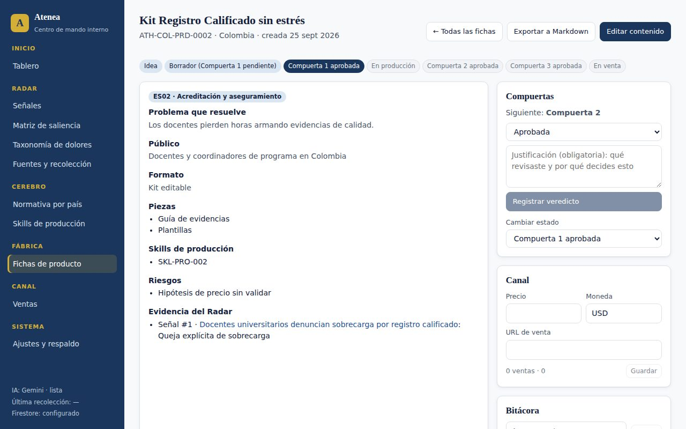

**Barra de etapas:** Idea → Borrador → Compuerta 1 → Producción → Compuerta 2 → Compuerta 3 → En
venta.

**Centro de la pantalla:** el contenido de la ficha. Con **Editar contenido** lo cambias; las
listas van una por línea. La **evidencia** tiene enlaces a las señales originales: ábrelas y
comprueba que dicen lo que la ficha afirma.

**Panel derecho: Compuertas**
- Muestra cuál es la **siguiente compuerta** (1, 2 o 3).
- Eliges un veredicto: **Aprobada**, **Aprobada con condición** o **Rechazada**.
- Escribes la **justificación**, que es obligatoria: qué revisaste y por qué decides eso.
- Pulsas **Registrar veredicto**. Queda en la bitácora con fecha y hora.
- **Al aprobar la Compuerta 1,** la ficha recibe su código oficial, por ejemplo
  `ATH-COL-PRD-0002`. La app evita los códigos que ya usan los productos de las carpetas
  `Fabrica…` del proyecto.
- **Si rechazas una compuerta,** la ficha se queda donde estaba. Corrige y vuelve a presentarla.
- **Cambiar estado:** para mover la ficha a mano. Por ejemplo, a «En producción» mientras se
  fabrican las piezas, a «En venta» cuando ya se vende, o a «Pausada» o «Descartada».

**Panel derecho: Canal**
- Registra el **precio**, la **moneda** y la **URL de venta**. Pulsa **Guardar**.
- Aquí también ves cuántas ventas lleva la ficha.

**Panel derecho: Bitácora**
- Es el historial de la ficha: creación, cambios de estado, veredictos y tus notas.
- Para agregar una nota, escríbela y pulsa **Anotar**.

**Botones de arriba:**
- **Exportar a Markdown:** descarga la ficha completa, con su bitácora, en un archivo `.md`. Sirve
  para guardarla en la carpeta del producto dentro del proyecto, por ejemplo como `00_ficha.md`.
- **← Todas las fichas:** vuelve a la lista.

**Eliminar ficha:** borra la ficha y su bitácora. Las ventas asociadas se conservan sin ficha.

---

## 8. Canal: ventas

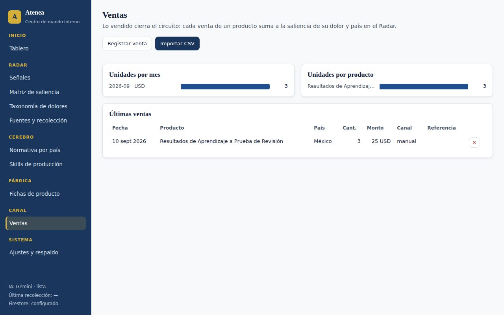

Lo vendido cierra el circuito: **cada venta suma peso al dolor y al país de su producto en la
matriz.**

- **Registrar venta:** para una venta suelta. Completa producto, fecha, país, cantidad, monto y
  moneda.
- **Importar CSV:** para el reporte de Hotmart.
  1. En Hotmart, exporta el reporte de ventas en formato CSV.
  2. En la app, pulsa **Importar CSV**.
  3. Elige el **producto** al que pertenecen esas ventas y, si el archivo no trae país, uno por
     defecto.
  4. Selecciona el archivo y pulsa **Importar**.
  5. La app te dice cuántas ventas importó, cuántas ya existían y cuántas omitió.

  No te preocupes por importar dos veces: los reembolsos y cancelaciones se omiten solos, y una
  transacción ya importada no se duplica.
- **Gráficos:** unidades por mes y unidades por producto.
- **Últimas ventas:** la lista completa. Con **✕** borras una venta registrada por error.

---

## 9. Ajustes y respaldo

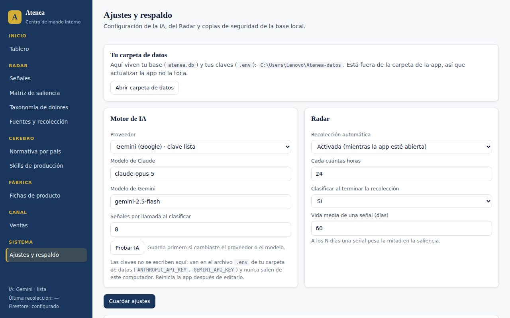

### Tu carpeta de datos

Tus datos viven en `C:\Users\Lenovo\Atenea-datos`:
- `atenea.db` es tu base: señales, fichas, ventas y todo lo demás;
- `.env` contiene tus claves.

**Esta carpeta está fuera de la app**, así que actualizar la app no la toca. Para verla, pulsa
**Abrir carpeta de datos**.

### Motor de IA

- **Proveedor:** Gemini (Google) o Claude (Anthropic). Al lado dice si tiene «clave lista».
- **Modelos:** puedes cambiarlos si el proveedor publica uno nuevo. Hoy: `gemini-2.5-flash` y
  `claude-opus-5`.
- **Señales por llamada al clasificar:** cuántas señales se envían juntas a la IA. Con 8 funciona
  bien. Bájalo a 4 si Gemini se queja de la cuota.
- **Probar IA:** hace una llamada de prueba y te dice si respondió.

**Las claves no se escriben en esta pantalla.** Para cambiar una clave:
1. Pulsa **Abrir carpeta de datos**.
2. Abre `.env` con el Bloc de notas.
3. Escribe la clave en su línea: `GEMINI_API_KEY=` o `ANTHROPIC_API_KEY=`.
4. Guarda el archivo.
5. **Reinicia la app:** cierra la ventana negra y ábrela con el ícono.

### Radar

- **Recolección automática:** activada o desactivada.
- **Cada cuántas horas:** por defecto, 24.
- **Clasificar al terminar la recolección:** si la IA revisa lo nuevo automáticamente.
- **Vida media de una señal:** en cuántos días una señal pierde la mitad de su peso. Por defecto,
  60.

Pulsa **Guardar ajustes** después de cambiar algo en Motor de IA o en Radar.

### Países del Radar

Haz clic en un país para activarlo o desactivarlo. Un país desactivado desaparece de la matriz.
Para que tampoco se busque, pausa su fuente en *Fuentes y recolección*.

### Respaldos

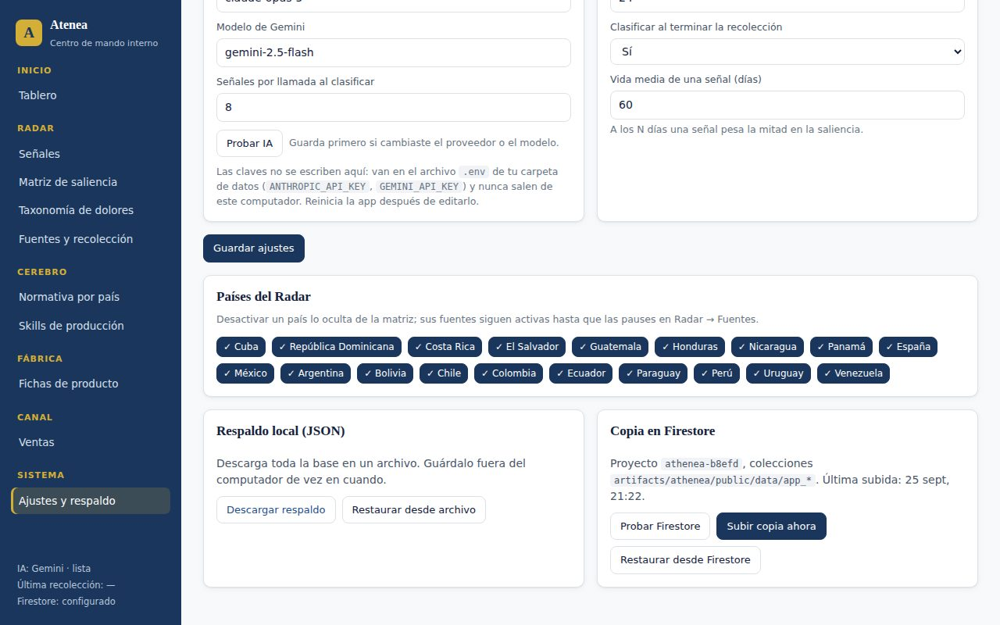

- **Respaldo local (JSON):**
  - **Descargar respaldo** guarda toda la base en un archivo. Súbelo a Google Drive de vez en
    cuando.
  - **Restaurar desde archivo** reemplaza todos tus datos por los del archivo. Pide confirmación.
- **Copia en Firestore:** una copia en la nube, en tu proyecto `athenea-b8efd`.
  - **Probar Firestore:** confirma que la conexión funciona, sin escribir nada.
  - **Subir copia ahora:** actualiza la copia en la nube. Hazlo **una vez por semana**.
  - **Restaurar desde Firestore:** reemplaza tus datos locales por la copia de la nube. **Úsalo
    solo si perdiste tus datos.**

---

## 10. Rutinas recomendadas

| Cuándo | Qué hacer | Tiempo |
|---|---|---|
| **Cada día** | Abrir la app y dejarla abierta unos 15 minutos para que corra la búsqueda automática. | 2 min |
| **Cada semana** | 1. Revisar *Fuentes → Últimas ejecuciones* y anotar los errores. 2. Validar o descartar 20-30 señales. 3. Registrar a mano la evidencia propia de la semana. 4. Mirar la matriz. 5. **Subir copia a Firestore**. | 30-45 min |
| **Cada mes** | 1. Revisar la taxonomía. 2. Verificar la normativa de los países con más señales. 3. Revisar las 3 mejores oportunidades y decidir si alguna merece ficha. 4. Importar las ventas de Hotmart. 5. Descargar un respaldo JSON a Drive. | 1-2 h |

Durante el piloto, sigue el plan semana a semana: [Plan_Piloto_4_semanas.md](Plan_Piloto_4_semanas.md).

---

## 11. Actualizar la app

Tus datos no se pierden al actualizar, porque viven en `Atenea-datos`, fuera de la app.

1. **Por precaución:** ve a *Ajustes* y pulsa **Descargar respaldo**.
2. **Cierra la app:** cierra la ventana negra.
3. **Descarga la versión nueva:** en la página del repositorio en GitHub, pulsa **Code → Download
   ZIP**.
4. **Descomprímela:** clic derecho sobre el ZIP → **Extraer todo**.
5. **Abre la versión nueva:** entra a la carpeta nueva → `atenea-app` → doble clic en **`Iniciar
   Atenea.bat`**. Instala lo que cambió y actualiza el ícono del escritorio.
6. **Comprueba** que tus señales y fichas siguen ahí. Después puedes borrar la carpeta vieja.

---

## 12. Problemas frecuentes

| Qué pasa | Qué hacer |
|---|---|
| **El navegador no se abre.** | Busca en la barra de tareas la ventana «Atenea - Centro de mando» y ábrela. Si muestra un error, cópialo. Si dice «Atenea lista», entra a `http://localhost:5180`. |
| **«El puerto 5180 ya está en uso».** | Hay otra ventana de Atenea abierta, quizá de una versión anterior. Ciérrala y vuelve a abrir la app. |
| **«Hay una versión ANTERIOR de Atenea abierta».** | Cierra la ventana negra vieja y abre la nueva. |
| **«No encuentro Node.js».** | Instala Node.js (versión LTS) desde nodejs.org. |
| **«No encuentro los archivos de la app».** | Abriste el iniciador desde dentro del ZIP. Descomprime primero con **Extraer todo**. |
| **«Falta la clave de IA» o «sin clave».** | Pon la clave en el `.env` (ver sección 9) y reinicia la app. |
| **«La clave de Gemini no es válida».** | Revisa que la copiaste completa, sin espacios ni comillas, o crea una nueva en aistudio.google.com/apikey. |
| **«Cuota agotada» (Gemini).** | Es el límite gratuito. Espera un rato y pulsa **Clasificar pendientes**. Nada se pierde. Si pasa seguido, baja «Señales por llamada» a 4. |
| **«Tu cuenta de Anthropic no tiene saldo».** | Carga créditos en console.anthropic.com → Billing. |
| **Una fuente da «HTTP 403» o «HTTP 429».** | El sitio está limitando las consultas. Suele pasar solo; si se repite varios días, pausa esa fuente. |
| **No veo el archivo `.env`.** | En el Explorador de archivos, activa *Vista → Mostrar → Elementos ocultos*. Ábrelo con clic derecho → Abrir con → Bloc de notas. |
| **Firestore dice «no configurado».** | Falta la línea `FIREBASE_SERVICE_ACCOUNT=...` en el `.env`, o la app no se reinició después de agregarla. |
| **Firestore dice «no tiene permiso».** | Revisa en la consola de Google Cloud que el service account tenga el rol «Cloud Datastore User» o «Editor». |
| **Borré algo por error.** | Si tienes un respaldo reciente, usa *Ajustes → Restaurar desde archivo* o *Restaurar desde Firestore*. Ten en cuenta que se pierde lo hecho después de ese respaldo. |

Para cualquier otro problema, copia el mensaje exacto (o toma una captura) y compártelo.

---

## 13. Glosario

| Término | Significado |
|---|---|
| **Señal** | Una publicación capturada: noticia, post, entrevista o respuesta de encuesta. |
| **Dolor** | Un problema recurrente de los docentes de educación superior, con código ES01 a ES09. |
| **Taxonomía** | La lista de dolores con la que se clasifica. |
| **Clasificar** | Decidir si una señal es relevante, qué dolores menciona, de qué país es y con qué intensidad. |
| **Validar** | Confirmar tú la clasificación. La señal gana peso. |
| **Intensidad** | 1 = mención, 2 = queja explícita, 3 = crisis o urgencia. |
| **Demanda** | Alguien pide o buscaría una solución. Es la señal más cercana a una venta. |
| **Frase-dolor** | Cita textual que expresa el dolor. La app solo la guarda si aparece de verdad en el texto. |
| **Saliencia** | Qué tan presente y urgente es un dolor en un país. |
| **Índice** | La saliencia en escala de 0 a 100, relativa a la combinación más fuerte. |
| **Vida media** | Días en que una señal pierde la mitad de su peso. Por defecto, 60. |
| **Fuente** | Un lugar donde el Radar busca: Google Noticias, Reddit o RSS. |
| **Ficha** | La propuesta de un producto, con evidencia, normativa, formato y precio hipótesis. |
| **Compuerta** | Un punto de control de calidad con tu veredicto escrito. Son tres antes de vender. |
| **Bitácora** | El historial de una ficha. |
| **Código ATH** | Identificador oficial del producto, por ejemplo `ATH-MEX-PRD-0003`. Se asigna en la Compuerta 1. |
| **Respaldo** | Copia de toda tu base: en un archivo JSON o en Firestore. |
| **`.env`** | Archivo de texto con tus claves privadas. Está en tu carpeta de datos. |
